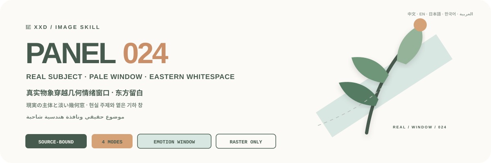
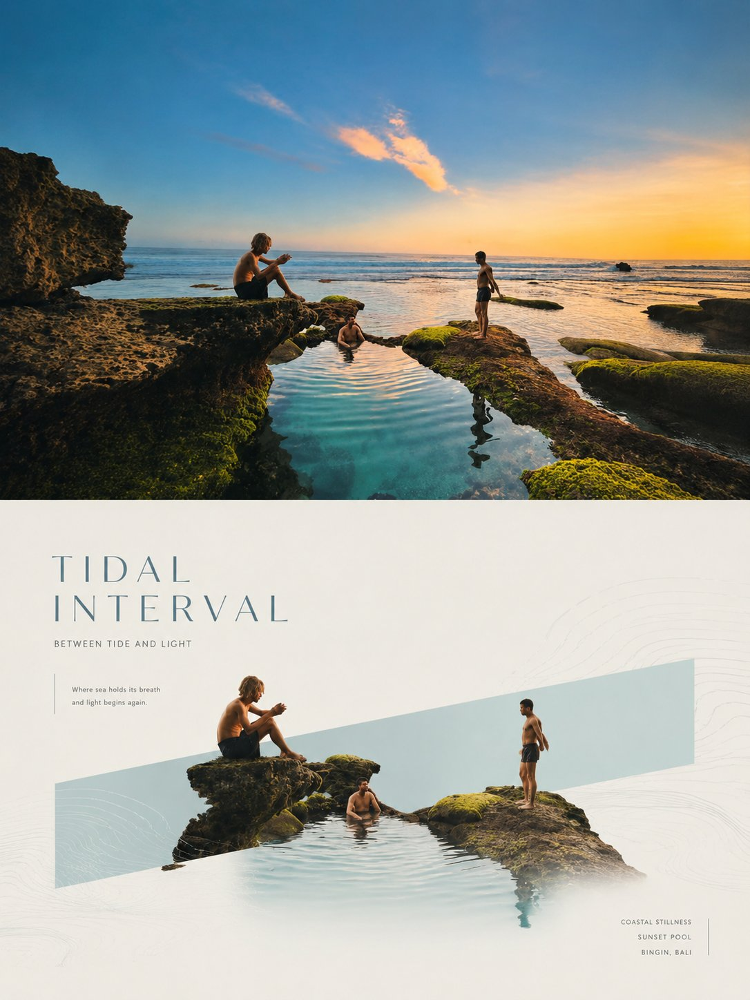
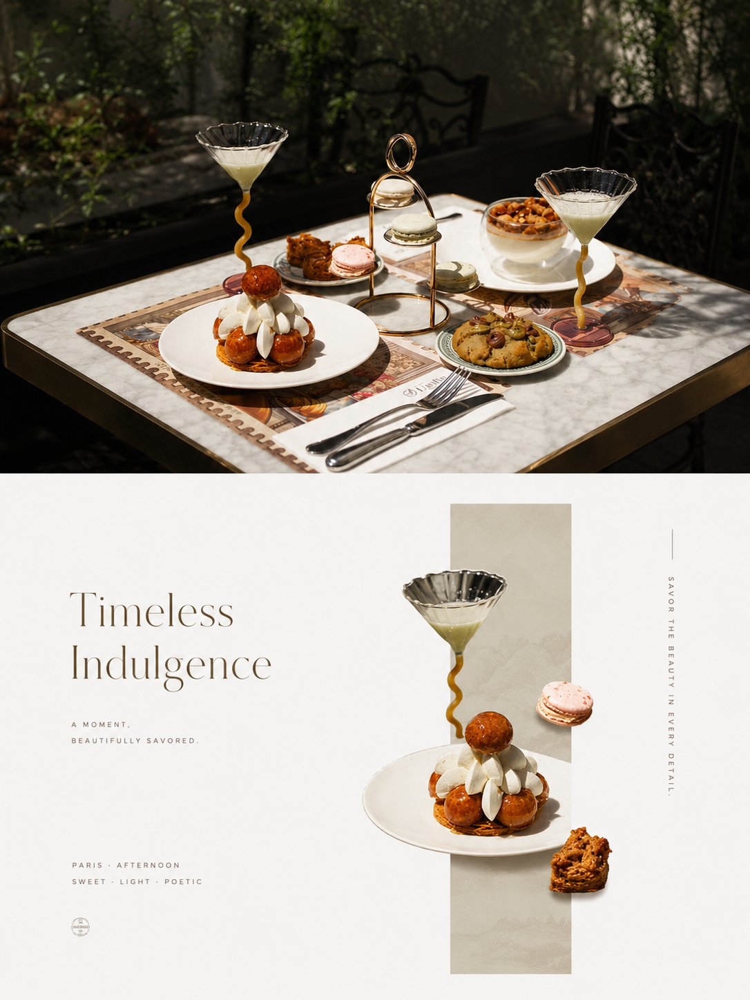
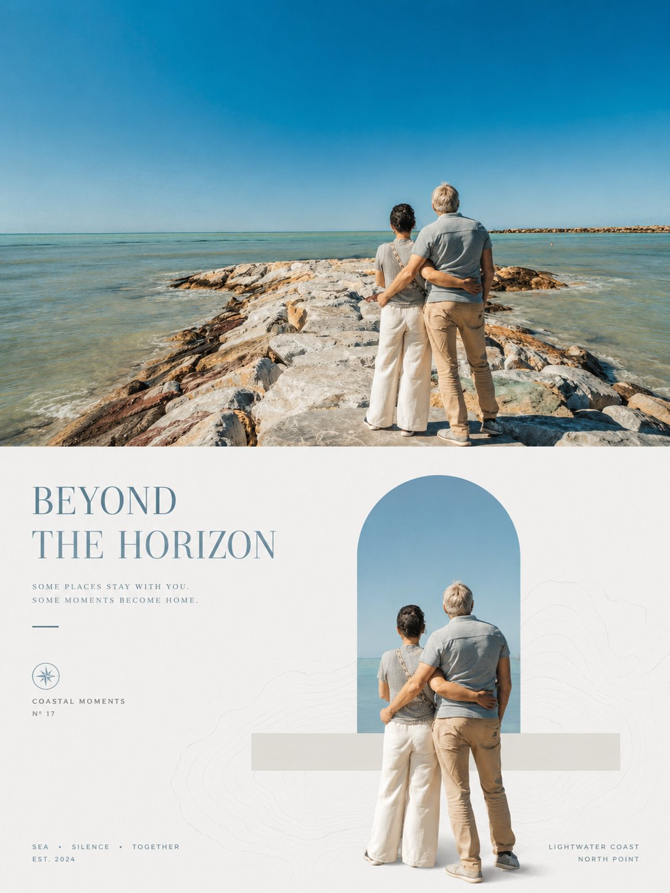

<p align="center">
  
</p>

<div align="center">

# 🦁 XXD Panel 024

### 현실의 주제를 옅은 기하학적 감정 창으로 통과시키기

[](./SKILL.md)
[](#네-가지-출력-하나의-검정-영역-돌파-논리)
[](#경계와-신뢰)

<a href="README.md">简体中文</a> · <a href="README.en.md">English</a> · <a href="README.ja.md">日本語</a> · <strong>한국어</strong> · <a href="README.ar.md">العربية</a>

</div>

> 사진적 주제 · 길고 옅은 창 · 가로／세로／사선 원본 적응 · 동양적 여백 · 프리미엄 편집

XXD Panel 024는 Codex와 호환 에이전트를 위한 이미지 생성 Skill입니다. 사진에서 정체성, 윤곽, 자세, 동작, 기능, 재질과 실제 색을 고정한 뒤 주제의 무게중심, 동작 방향, 윤곽 흐름과 지면 리듬에 따라 가로형, 세로형 또는 사선의 길고 옅은 저채도 기하 창 하나를 선택합니다.

주제는 사진적 또는 정교한 사실성을 유지하고 창 안으로 들어가 한 번의 분명한 국소 돌파, 프레임 파괴, 연장 또는 통과를 만듭니다. 원본에서 가져온 옅은 창, 실제 주제색, 소량의 중성 문자, 흰색／옅은 회색／매우 옅은 온색 바탕, 넓은 동양적 여백과 최대 한 겹의 희미한 문화／선형 보조층으로 프리미엄 광고 감각을 만듭니다.

## 왜 024이 필요한가요

일반적인 ‘검정 면＋선화’는 주제를 직사각형 위에 붙인 포스터 템플릿으로 쉽게 무너집니다. 경계에는 사건이 없고 선은 너무 매끈하며 주제, 검정 영역과 문자가 서로 작동하지 않습니다.

024은 순서를 뒤집습니다.

```text
원본 정체성／재질／실제 색／주요 동작 고정 → 무게와 윤곽에서 가로／세로／사선의 길고 옅은 창 선택 → 현실 주제를 넣고 한 번의 국소 통과 → 흰색／옅은 회색／매우 옅은 온색과 넓은 여백 → 최대 한 겹의 희미한 문화／선형 보조 → 옅은 창＋실제 주제색＋소량 중성 문자 → 창·주제·여백 관계로 마감
```

무관한 사진으로 바꿔도 창 방향, 주제 통과, 재질, 실제 색, 초점 균형, 보조층과 문구가 거의 그대로 성립한다면 024가 아닙니다.

## 024의 시각적 원칙

- **길고 옅은 창 하나:** 가로, 세로, 사선 방향을 원본의 무게, 동작, 윤곽에서 선택합니다.
- **현실 주제의 통과:** 세 가지 이상 원본 단서, 재질, 실제 색, 동작을 보존하고 한 번의 분명한 국소 돌파를 만듭니다.
- **완전한 붙여넣기가 아님:** 자연스럽게 자라고 프레임을 깨며 공간을 통과합니다.
- **동양적 여백:** 흰색, 옅은 회색, 매우 옅은 온색 바탕에서 한 초점을 유지합니다.
- **보조층 최대 하나:** 매우 옅은 문화 무늬, 지형선, 물결, 빛 윤곽 또는 추상 선만 종속시킵니다.
- **원본 기반 상업 색:** 옅은 창＋실제 주제색＋소량 중성 문자. 형광, 탁한 회색, 어두운 바탕, 전체 필터는 제외합니다.
- **프리미엄 편집 문자:** 짧은 제목과 소수의 보조 정보를 창, 통과 방향, 여백에 통합합니다.

## 예시 · X에서

> [샤오샤오둥（@xiaoxiaodong01）](https://x.com/xiaoxiaodong01/status/2090415726813393008) · 2026-08-20<br>
> GPT2 x 几何窗口 x 穿越 x 美学提示词 x VOL.24<br>
> 원문은 앞자리 0이 없는 VOL.24 표기를 사용하며 시리즈에서는 XXD Panel 024에 해당합니다.

<table>
  <tr>
    <td width="50%"><a href="https://x.com/xiaoxiaodong01/status/2090415726813393008"></a></td>
    <td width="50%"><a href="https://x.com/xiaoxiaodong01/status/2090415726813393008"></a></td>
  </tr>
  <tr>
    <td width="50%"><a href="https://x.com/xiaoxiaodong01/status/2090415726813393008"></a></td>
    <td width="50%"><a href="https://x.com/xiaoxiaodong01/status/2090415726813393008"></a></td>
  </tr>
</table>

<p align="center"><a href="https://x.com/xiaoxiaodong01/status/2090415726813393008">원문 게시물과 전체 프롬프트 보기 →</a></p>

이 예시는 024의 미학적 의도를 보여 줄 뿐이며, 예시의 주제, 구성, 색상, 문구, 이전 캔버스 비율은 생성 참고나 현재 기본값이 되지 않습니다.

## 원본 프롬프트가 유일한 미적 기준입니다

`references/024-source.md`는 이 프로젝트의 유일한 창작·미적 기준입니다. Skill은 원문을 요약하거나 확장하지 않으며 공통 색상 계획, 미적 동기, 제목, 마이크로카피를 추가하지 않습니다. 색, 재료, 구성, 여백, 문구, 타이포그래피는 GPT Image 2가 원본 프롬프트의 규칙대로 수행합니다.

모드와 크기가 덮어쓰는 것은 기존 3:4 상하 컨테이너뿐입니다. 좌우 모드에서는 ‘위 사진／아래 디자인’을 왼쪽／오른쪽으로 대응시키고, 디자인 단독 및 배경화면 모드에서는 아래쪽 디자인 언어를 전체 캔버스로 확장합니다. 나머지 원본 지시는 모두 유지됩니다.

## 원본 프롬프트가 유일한 미적 기준입니다

`references/024-source.md`는 이 프로젝트의 유일한 창작·미적 기준입니다. Skill은 원문을 요약하거나 확장하지 않으며 공통 색상 계획, 미적 동기, 제목, 마이크로카피를 추가하지 않습니다. 색, 재료, 구성, 여백, 문구, 타이포그래피는 GPT Image 2가 원본 프롬프트의 규칙대로 수행합니다.

모드와 크기가 덮어쓰는 것은 기존 3:4 상하 컨테이너뿐입니다. 좌우 모드에서는 ‘위 사진／아래 디자인’을 왼쪽／오른쪽으로 대응시키고, 디자인 단독 및 배경화면 모드에서는 아래쪽 디자인 언어를 전체 캔버스로 확장합니다. 나머지 원본 지시는 모두 유지됩니다.

## 원본 프롬프트가 유일한 미적 기준입니다

`references/024-source.md`는 이 프로젝트의 유일한 창작·미적 기준입니다. Skill은 원문을 요약하거나 확장하지 않으며 공통 색상 계획, 미적 동기, 제목, 마이크로카피를 추가하지 않습니다. 색, 재료, 구성, 여백, 문구, 타이포그래피는 GPT Image 2가 원본 프롬프트의 규칙대로 수행합니다.

모드와 크기가 덮어쓰는 것은 기존 3:4 상하 컨테이너뿐입니다. 좌우 모드에서는 ‘위 사진／아래 디자인’을 왼쪽／오른쪽으로 대응시키고, 디자인 단독 및 배경화면 모드에서는 아래쪽 디자인 언어를 전체 캔버스로 확장합니다. 나머지 원본 지시는 모두 유지됩니다.

## 원본 프롬프트가 유일한 미적 기준입니다

`references/024-source.md`는 이 프로젝트의 유일한 창작·미적 기준입니다. Skill은 원문을 요약하거나 확장하지 않으며 공통 색상 계획, 미적 동기, 제목, 마이크로카피를 추가하지 않습니다. 색, 재료, 구성, 여백, 문구, 타이포그래피는 GPT Image 2가 원본 프롬프트의 규칙대로 수행합니다.

모드와 크기가 덮어쓰는 것은 기존 3:4 상하 컨테이너뿐입니다. 좌우 모드에서는 ‘위 사진／아래 디자인’을 왼쪽／오른쪽으로 대응시키고, 디자인 단독 및 배경화면 모드에서는 아래쪽 디자인 언어를 전체 캔버스로 확장합니다. 나머지 원본 지시는 모두 유지됩니다.

## 원본 프롬프트가 유일한 미적 기준입니다

`references/024-source.md`는 이 프로젝트의 유일한 창작·미적 기준입니다. Skill은 원문을 요약하거나 확장하지 않으며 공통 색상 계획, 미적 동기, 제목, 마이크로카피를 추가하지 않습니다. 색, 재료, 구성, 여백, 문구, 타이포그래피는 GPT Image 2가 원본 프롬프트의 규칙대로 수행합니다.

모드와 크기가 덮어쓰는 것은 기존 3:4 상하 컨테이너뿐입니다. 좌우 모드에서는 ‘위 사진／아래 디자인’을 왼쪽／오른쪽으로 대응시키고, 디자인 단독 및 배경화면 모드에서는 아래쪽 디자인 언어를 전체 캔버스로 확장합니다. 나머지 원본 지시는 모두 유지됩니다.

## 조합 가능한 네 가지 출력

`top-bottom`, `left-right`, `design-only`, `wallpaper-pack`을 하나 이상 선택할 수 있습니다. 쌍 구성은 기본적으로 완성 캔버스 한 장으로 직접 생성하며, 결정론적 합성은 재시도 실패, 원본 사진의 픽셀 완전 보존, 무손실 크기 보정이 필요할 때만 사용합니다.

일반 크기도 복수 선택할 수 있습니다: 자동 맞춤, 원본 비율, 1:1, 3:4, 4:3, 4:5, 5:4, 2:3, 3:2, 9:16, 16:9, 21:9, 5:7, 7:5, 사용자 비율／정확한 픽셀. 암묵적 기본 크기는 없습니다. 서로 다른 비율은 동일한 원본 프롬프트에서 각각 다시 구성합니다.

배경화면 세트는 연속형 또는 독립형입니다. 연속형은 먼저 기준 이미지 한 장을 만들고, 나머지는 원본 사진＋기준 이미지를 함께 참고해 각 기기에 맞게 재구성합니다. 한 이미지를 네 크기로 기계적으로 자르지 않습니다.

## 텍스트 모드

생성 전에 다음 중 하나를 정합니다.

1. **원본 프롬프트에 따라 모델이 텍스트 생성**: 사용자는 언어 또는 지역만 지정하고, 내용·분량·톤·타이포그래피는 GPT Image 2가 원문 규칙대로 생성합니다.
2. **내 정확한 문구 사용**: 한 글자도 바꾸지 않고 전달하며 재작성, 번역, 제목 추가를 하지 않습니다. 배치는 원문을 따릅니다.
3. **텍스트 없음**: 모든 텍스트와 가짜 문자를 금지합니다.

외부 Skill은 제목이나 마이크로카피를 미리 쓰지 않습니다. 출력 언어는 인터페이스 언어와 별도로 확인하며 인물, 장면, 파일명에서 추정하지 않습니다.

## 완성 캔버스 우선과 래스터 경계

이미지 모델이 완성 화면 전체의 미학적 재구성을 담당하며 이중 패널도 완성 캔버스 한 장의 직접 생성을 기본으로 합니다. `scripts/compose_panel.py`는 조건부 복구, 무손실 픽셀 조정, 읽기 전용 검수에만 사용하고 매번 사전 계획하거나 미학적 성공을 판단하지 않습니다.

모든 결과물은 PNG 래스터이며 호출마다 `~/Desktop/xxd/`에 새 작업을 만듭니다. 설정된 이미지 경로는 비식별 상태만 반환하며 제공자, 엔드포인트, 인증 정보, 헤더, 프롬프트, 응답, 계정 정보를 공개하지 않습니다. SVG, HTML, Canvas, 도표와 프로그램 그림은 최종 작품을 대신할 수 없습니다.

## 선택형 UI와 인라인 매개변수

실행 환경에 실제 대화형 컨트롤이 있으면 카드형 선택을 우선 사용합니다. 출력 모드와 일반 이미지 크기는 다중 선택이며, 문구 방식과 배경화면 관계는 단일 선택입니다. 크기는 자동 맞춤, 원본 비율, 1:1, 3:4, 4:3, 4:5, 5:4, 2:3, 3:2, 9:16, 16:9, 21:9, 5:7, 7:5 및 사용자 지정 비율/픽셀을 지원합니다. 대화형 컨트롤이 없으면 클릭할 수 없는 가짜 체크박스 대신 읽기 쉬운 여러 줄 번호 메뉴를 사용합니다.

모든 설정은 호출 뒤에 인라인 변수로 직접 지정할 수도 있습니다.

```text
/xxd-panel-024 photo.jpg --mode top-bottom,design-only --size auto,3:4,9:16 --text prompt --locale ja-JP
```

`--mode`, 반복 또는 쉼표 구분 `--size`, `--text prompt|exact|none`, `--locale`, `--copy`, `--wallpaper linked|independent`, `--wallpaper-size`, `--out`을 지원합니다. 필요한 매개변수가 모두 있으면 사전 질문 없이 바로 생성하고, 일부만 있으면 누락된 항목만 묻습니다. 서로 다른 화면비는 각각 다시 구성하며, 4종 기기 배경화면은 일반 크기 선택과 기계적으로 곱하지 않는 별도 분기입니다.

## 이미지 모델 우선순위

GPT Image 2를 기본 최우선 모델로 사용합니다. 고충실도 원본 참조, 생성 전 완성 캔버스 확인, 이중 패널의 완성 화면 일괄 생성, 조건이 충족될 때만 사용하는 스크립트 합성이라는 기존 흐름은 그대로 유지합니다.

현재 도구 또는 설정된 경로에서 실제로 사용할 수 있고 원본 충실도, 완성 화면비, 대상 언어의 문자, 연결형 배경화면의 다중 참조 요구를 충족할 때는 Seedance 5.0 Pro, Nano Banana Pro(Gemini Image Pro), Nano Banana 2(Gemini Image Flash) 또는 다른 호환 비트맵 모델도 사용할 수 있습니다. 대체 모델은 생성 경로만 바꾸며 모드, 캔버스, 문구, 언어, 배경화면 관계와 완성 캔버스 우선 전략을 바꾸지 않습니다.

적합한 경로가 없으면 이미지 생성 도구를 활성화하거나 API Key를 제공하도록 사용자에게 요청합니다. 사용자가 제공한 인증 정보는 현재 작업에 사용할 수 있지만 답변이나 로그에 다시 표시·기록·노출하지 않습니다. 사용자가 명시적으로 요청하지 않는 한 장기 저장하거나 제공자, 계정, 결제 또는 전역 경로 설정을 변경하지 않습니다.

## 시작하기

```bash
git clone https://github.com/nevertoday/xxd-panel-024.git
mkdir -p ~/.codex/skills
ln -s "$(pwd)/xxd-panel-024" ~/.codex/skills/xxd-panel-024
```

Claude Code 사용자는 같은 폴더를 `~/.claude/skills/xxd-panel-024`에 연결할 수 있습니다. 설치 후 에이전트 세션을 다시 시작하세요.

```text
$xxd-panel-024
이 사진을 좌우 구성으로 만들어 주세요. 문구는 사진의 의미에서 만들고 자연스러운 한국어를 사용하세요.
```

사진만 첨부해 호출해도 됩니다. 번호가 붙은 여러 줄 메뉴로 모드와 문구 설정을 확인하고, 배경화면 모드에서는 연결형／독립형과 기기 크기도 확인합니다.

전체 사양:

- [Skill 워크플로](SKILL.md)
- [중문 런타임 어댑터](references/xxd-panel-024-prompt.zh-CN.md)
- [영문 런타임 어댑터](references/xxd-panel-024-prompt.en.md)
- [원본 스타일 지시](references/024-source.md)

## 경계와 신뢰

- 각 사진은 독립된 작업 안에서만 사용하며 다른 입력, 과거 결과, 예시의 피사체, 색, 문구, 구도를 빌리지 않습니다.
- 호출할 때마다 새 작업 폴더를 만들고 원본과 조건이 같아도 새로 생성합니다.
- 결과물은 PNG 비트맵이며 SVG, HTML, Canvas, 프로그램 드로잉 대체물이 아닙니다.
- 설정된 비트맵 브리지는 정제된 상태만 출력하며 공급자, 엔드포인트, 헤더, 인증 정보, 프롬프트, 응답 본문을 노출하지 않습니다.
- 선택한 일반 모드마다 파일 1개를 반환하고, `wallpaper-pack`을 선택하면 독립 배경화면 4개를 추가합니다. `전체`는 원본 한 장당 PNG 7개를 네 개의 동급 모드 폴더에 저장하며 모음 이미지로 합치지 않습니다.

로컬 합성에는 Python 3와 Pillow가 필요합니다. 안전한 비트맵 브리지는 Python 3.11 이상의 `tomllib`을 사용합니다. 이미지 생성에는 내장 래스터 기능이 있는 호스트 에이전트 또는 이미 설정된 호환 경로가 필요합니다.

## 저장소

```text
xxd-panel-024/
├── SKILL.md
├── README.md / README.en.md / README.ja.md / README.ko.md / README.ar.md
├── agents/openai.yaml
├── assets/banner.svg + examples/ (향후 로컬 예시용)
├── scripts/compose_panel.py + configured_imagegen.py
└── references/xxd-panel-024-prompt.zh-CN.md + xxd-panel-024-prompt.en.md + 024-source.md
```

## XXD 소개

XXD는 Xiaoxiaodong의 브랜드 약칭입니다. 이 프로젝트는 [@xiaoxiaodong01](https://x.com/xiaoxiaodong01)이 만들고 관리합니다.

## 지원 및 멤버십

### 심층 상담 · CNY 299/시간

Skills 사용에 관한 일대일 상담은 시간당 CNY 299입니다. 아래 WeChat QR 코드로 예약하세요.

### Xiaoxiaodong Skills 사용자 교류방 · CNY 99

일회성 CNY 99를 내면 워크플로 공유, 작품 토론, 사용자 간 도움을 위한 교류방에 참여할 수 있습니다. 시간제 일대일 상담은 포함되지 않습니다.

### 지식성구＋회원 프롬프트 라이브러리 · CNY 699/년

[지식성구](https://wx.zsxq.com/group/15554814142882)와 [XXD 회원 프롬프트 라이브러리](https://vip.xiaoxiaodong.ai/)는 하나의 멤버십입니다. **연회비를 한 번 결제하면 두 서비스를 모두 이용할 수 있으며 추가 구매는 필요하지 않습니다.**

1. 지식성구에서 가입한 뒤 WeChat으로 프롬프트 라이브러리 교환 코드를 받습니다.
2. 프롬프트 라이브러리에서 가입한 뒤 WeChat으로 지식성구 초대를 받습니다.

<p align="center">
  <a href="https://xiaoxiaodong.pages.dev/assets/wechat-qr.png"></a>
</p>

<div align="center">

**검정은 거칠고 흰색은 깨끗하게. 하나의 동작과 한 면의 고요함이면 관계를 남길 수 있습니다.**

</div>

---

<div align="center">
  <h2>☕ 오픈 소스 프로젝트 후원하기</h2>
  <p>이 프로젝트가 시간을 아껴 주었다면 Star, 공유, 커피 한 잔으로 지속적인 개발을 응원해 주세요.</p>
  <table><tr><td align="center" width="240">
    <a href="https://github.com/nevertoday/zhongguo-traditional-colors/blob/main/docs/images/buy-me-a-coffee-qr.png?raw=true"></a><br>
    <strong>Buy me a coffee</strong><br><sub>QR 코드를 스캔하거나 열어 후원할 수 있습니다.</sub>
  </td></tr></table>
  <p><sub>후원은 전적으로 선택 사항이며 이 오픈 소스 프로젝트의 이용 권한에는 영향을 주지 않습니다.</sub></p>
</div>
